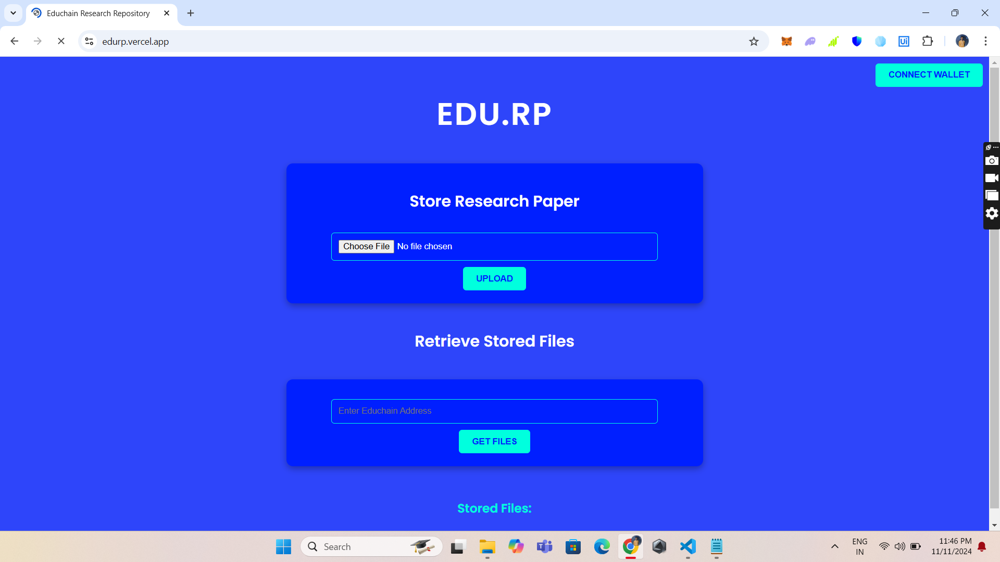

# EDU.RP
## 

## Idea
Educhain Based Research Repository

## Description	
A repository for academic research papers, ensuring immutability and accessibility.

## Execution
Using [PINATA](https://www.pinata.cloud/), I am storing the research paper on IPFS for this project. After that, it was kept in the EDU chain for everyone to access and maintain immutability.

## Upload & GetFiles


## Packages
```sh
    npm install 
    'axios' 
    'dotenv' 
    'express' 
    'express-fileupload'
    'form-data' 
    'path' 
    'web3'
```
## Usage

To start the application, run:
```sh
node server.js
```

Open your browser and navigate to `http://localhost:5500` to access EDU.RP
